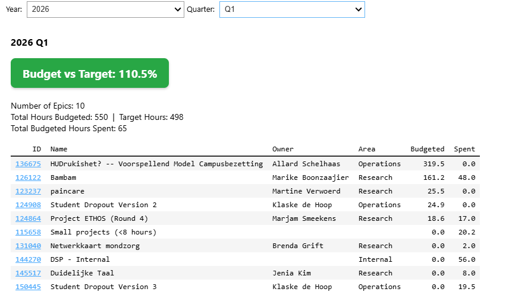

# DSP KPI Dashboard

Dashboard for tracking KPIs from the Azure DevOps Data Science Pool project at Hogeschool Utrecht.

This repository fetches backlog data (Epics, Features, User Stories and Tasks) from the Azure DevOps REST API, transforms it into a hierarchical structure, and provides an interactive Jupyter notebook for analysis and visualisation of project progress.

> **Status:** V1.0 done.

## Dashboard Preview



The dashboard provides an interactive view of Epic budgets vs. targets, showing budgeted hours, hours spent, and progress across different project areas (Operations, Research, Internal).

## How It Works

1. **Fetch** — `fetch_data_science_pool_backlog.py` authenticates with a Personal Access Token and downloads all work items from the *Data Science Pool* project via the Azure DevOps REST API.
2. **Transform** — `backlog_hierarchical_transformer.py` takes the raw flat export and restructures it into an Epic → Feature → User Story → Task hierarchy, enriching it with statistics by type and state.
3. **Analyse** — The `features_analysis.ipynb` notebook loads the transformed data into a pandas DataFrame for interactive exploration, filtering, and dashboard-style visualisations.

## Project Structure

```
azure_devops_data/  # Fetched backlog data (gitignored)
notebooks/          # Jupyter notebook for analysis
src/
  scripts/          # Data fetching & processing scripts

```

## Getting Started

1. Clone the repo
2. Create a virtual environment and activate it:
   ```
   python -m venv .venv
   .venv\Scripts\Activate.ps1
   ```
3. Install dependencies:
   ```
   pip install -r requirements.txt
   ```
4. Copy `example.env` to `.env` and add your Azure DevOps PAT (needs *Project and Team: Read* and *Work Items: Read* permissions):
   ```
   cp example.env .env
   ```
5. Run the notebook to wrangle the data and create the dashboard:
   ```
   jupyter notebook notebooks/features_analysis.ipynb
   ```